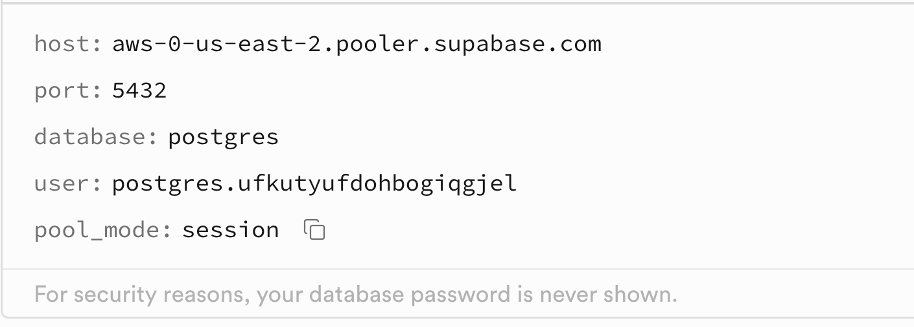
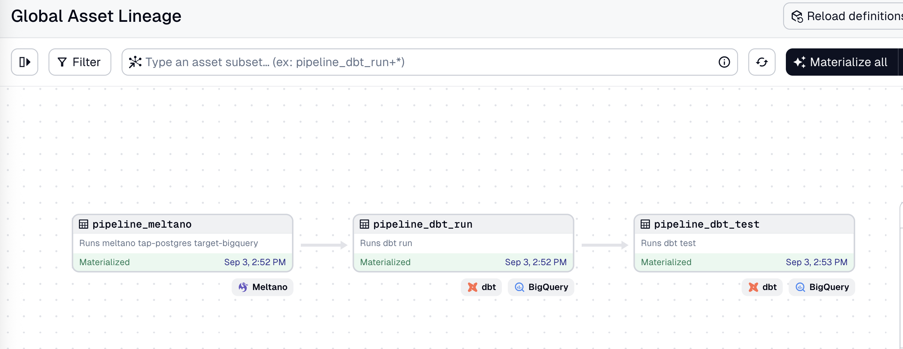
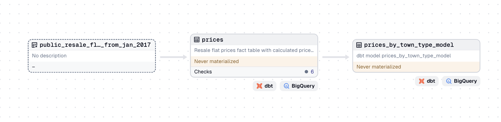
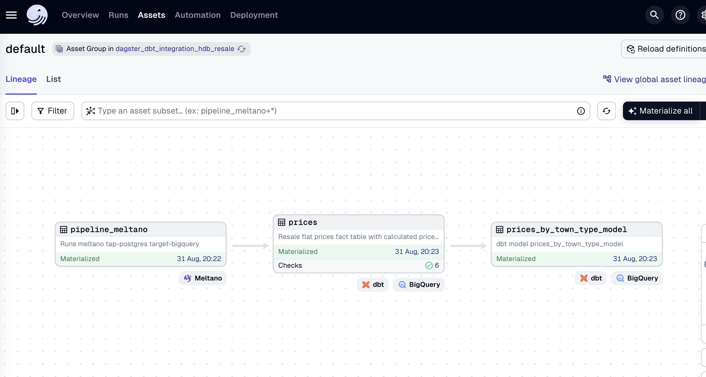

# SCTP DSAI DS2 Coaching ELT  E2E Dagster
### Add an Extractor to Pull Data from Postgres (Supabase)

In your existing GCP project, go to BigQuery. Then create a dataset in BigQuery called `resale` (multi-region: US).

We will use the `tap-postgres` extractor to pull data from a Postgres database hosted on [Supabase](https://supabase.com). 

> Supabase is an open-source backend-as-a-service platform that provides a suite of tools for building applications powered by PostgreSQL (Postgres) as its database. Postgres is a powerful, object-relational database system known for its reliability, extensibility and compliance with SQL standards. Supabase simplifies database management by offering an intuitive interface to interact with Postgres, making it a popular choice for developers looking for a scalable and flexible backend solution.

Go to the [Supabase](https://supabase.com) and create an account. Download the HDB housing data `Resale*.csv` file from the `data/` folder. Follow the instructions in this [setup file](supabase_db_setup_hdb.md) to setup your Postgres database table with the HDB housing data of resale flat prices based on registration date from Jan-2017 onwards. It is the same data that we used in module 1.

From Supabase, take note of your connection details from the Connection window, under Session Spooler:



We're going to add an extrator for Postgress to get our data. An extractor is responsible for pulling data out of any data source. We will use the `tap-postgress` extractor to pull data from the Supabase server. 

Please exit `meltano-ingestion` folder, use `cd ..` to return to the root folder. Create a new Meltano project by running:

```bash
meltano init meltano-resale
cd meltano-resale
```
To add the extractor to our project, run:

```bash
meltano add extractor tap-postgres
```

Next, configure the extractor by running:

```bash
meltano config tap-postgres set --interactive
```

Configure the following options:

- `database`: `postgres`
- `filter_schemas`: `['public']`
- `host`: `aws-0-ap-southeast-1.pooler.supabase.com` *(example)*
- `password`: *database password*
- `port`: `5432`
- `user`: *postgres.username*

Test your configuration:

```bash
meltano config tap-postgres test
```
We will now add a loader to load the data into BigQuery.

```bash
meltano add loader target-bigquery
```

```bash
meltano config target-bigquery set --interactive
```

Set the following options:

- `batch_size`: `104857600`
- `credentials_path`: _full path to the service account key file_
- `dataset`: `resale`
- `denormalized`: `true`
- `flattening_enabled`: `true`
- `flattening_max_depth`: `1`
- `method`: `batch_job`
- `project`: *your_gcp_project_id*

You can refer to an example of the `meltano.yml` in the `solutions` branch of the lesson 2.6 repo [here](https://github.com/su-ntu-ctp/5m-data-2.6-data-pipelines-orchestration/blob/solutions/solutions/meltano-ingestion/meltano.yml).

### Run Supabase (Postgres) to BigQuery

We can now run the full ingestion (extract-load) pipeline from Supabase to BigQuery.

```bash
meltano run tap-postgres target-bigquery
```

You will see the logs printed out in your console. Once the pipeline is completed, you can check the data in BigQuery.


### Create Dbt project

Let's create a Dbt project to transform the data in BigQuery. Before that please exit the `meltano-resale` folder by using the command `cd ..`.

To create a new dbt project.

```bash
dbt init resale_flat
```

Fill in the required config details. 
- use service account
- add your path of the json key file
- dataset: resale
- project: your GCP project ID

Please note that the profiles is located at the hidden folder .dbt of your home folder. The `profiles.yml` that is located in the home folder includes multiple projects. Alternatively, you can create a seprate `profiles.yml` for each project.

To create separate profiles for each project, create a new file called `profiles.yml` under `resale_flat` folder. Then copy the following to `profiles.yml`. Remember to change your key file location and your project ID.
```yaml
resale_flat:
  outputs:
    dev:
      dataset: resale
      job_execution_timeout_seconds: 300
      job_retries: 1
      keyfile: /Users/zanelim/Downloads/personal/secret/meltano-learn-03934027c1d8.json # Use your path of key file
      location: US
      method: service-account
      priority: interactive
      project: meltano-learn # enter your google project id
      threads: 1
      type: bigquery
  target: dev
```

### Create source and models

We can start to create the source and models in the dbt project.

> 1. Create a `source.yml` which points to the `ingestion` schema and `resale_flat_prices_from_jan_2017` table.
> 2. Create a `prices.sql` model (materialized table) which selects all columns from the source table, cast the `floor_area_sqm` to numeric, then add a new column `price_per_sqm` which is the `resale_price` divided by `floor_area_sqm`.
> 3. Create a `prices_by_town_type_model.sql` model (materialized table) which selects the `town`, `flat_type` and `flat_model` columns from `prices`, group by them and calculate the average of `floor_area_sqm`, `resale_price` and `price_per_sqm`. Finally, sort by `town`, `flat_type` and `flat_model`.

### Run Dbt

Check dbt connection first

```bash
dbt debug
```

Optional: you can run `dbt clean` to clear any logs or run file in the dbt folders.

Run the dbt project to transform the data.

```bash
dbt run
```

You should see 2 new tables in the `resale_flat` dataset.

## Dagster Using Subprocess

This is similar to lesson 2.7 Extra - Hands-on with Orchestration I, where we use the code of pipelinetwo.py as our assets. We did modified the dbt seed into meltano command.

First the create a project at root folder

```bash
dagster project scaffold --name dagster_hdb_subprocess
```

Please check the `assets.py` and `definitions.py` for details.

```python
# assets.py
from dagster import asset
import subprocess


@asset
def pipeline_meltano()->None:
    """
    Runs meltano tap-postgres target-bigquery
    """
    cmd = ["meltano", "run", "tap-postgres", "target-bigquery"]
    cwd = '/Users/aiml/Documents/VSCode-Git/sctp-dsai-ds2-coaching-elt-e2e-dagster/meltano-resale'
    try:
        output= subprocess.check_output(cmd,cwd=cwd,stderr=subprocess.STDOUT).decode()
    except subprocess.CalledProcessError as e:
            output = e.output.decode()
            raise Exception(output)

@asset(deps=[pipeline_meltano])
def pipeline_dbt_run()->None:
    """
    Runs dbt run 
    """
    cmd = ["dbt", "run"]
    cwd = '/Users/aiml/Documents/VSCode-Git/sctp-dsai-ds2-coaching-elt-e2e-dagster/dbt_resale'
    try:
        output= subprocess.check_output(cmd,cwd=cwd,stderr=subprocess.STDOUT).decode()
    except subprocess.CalledProcessError as e:
            output = e.output.decode()
            raise Exception(output)

@asset(deps=[pipeline_dbt_run])
def pipeline_dbt_test()->None:
    """
    Runs dbt test 
    """
    cmd = ["dbt", "test"]
    cwd = '/Users/aiml/Documents/VSCode-Git/sctp-dsai-ds2-coaching-elt-e2e-dagster/dbt_resale'
    try:
        output= subprocess.check_output(cmd,cwd=cwd,stderr=subprocess.STDOUT).decode()
    except subprocess.CalledProcessError as e:
            output = e.output.decode()
            raise Exception(output)  
```

```python
# definitions.py
from dagster import (
    Definitions,
    ScheduleDefinition,
    define_asset_job,
    load_assets_from_modules,
)
# import all assets
import dagster_hdb_subprocess.assets as assets_module

all_assets = load_assets_from_modules([assets_module])

# Complete ELT pipeline job
elt_job = define_asset_job(
    name="daily_elt_pipeline",
    selection="*",
    description="Meltano extraction → dbt transformation → data quality tests"
)

# Daily schedule at 2 AM
daily_schedule = ScheduleDefinition(
    job=elt_job,
    cron_schedule="0 2 * * *",
    name="daily_elt_schedule",
    description="Daily resale data pipeline"
)

defs = Definitions(
    assets=all_assets,
    jobs=[elt_job],
    schedules=[daily_schedule],
)

```

The resulting lineage graph is as follows:




While this process works, we cannot the much details in dbt. Thankfully, there is dbt and Dagster integration as follows.

## Dagster Using dbt Integration

This is similar to lesson 2.7 Extra - Hands-on with Orchestration II, where we create a dbt-dagster integrated project and we add meltano as a subprocess.

Use the following command:

```bash
dagster-dbt project scaffold --project-name dagster_dbt_integration --dbt-project-dir #full-path-to-the-resale-flat-dbt-project-directory
```
If you run `dagster dev` at this stage, you can see the asset lineage graph as follows:



If you have more complex dimension table, it will present here and the dependencies are automatically resolved by Dagster. Furthermore, we do not need to run dbt test, if you look at the box under `prices`, there is a row call `check`. So when they are materializing the prices table, it will perform dbt test at the same time.

Next we would like to add meltano as subprocess.

```python
# assets.py
from dagster import AssetExecutionContext, asset
from dagster_dbt import DbtCliResource, dbt_assets

from .project import dbt_resale_project

import subprocess

@asset
def pipeline_meltano()->None:
    """
    Runs meltano tap-postgres target-bigquery
    """
    cmd = ["meltano", "run", "tap-postgres", "target-bigquery"]
    cwd = '/Users/aiml/Documents/VSCode-Git/sctp-dsai-ds2-coaching-elt-e2e-dagster/meltano-resale'
    try:
        output= subprocess.check_output(cmd,cwd=cwd,stderr=subprocess.STDOUT).decode()
    except subprocess.CalledProcessError as e:
            output = e.output.decode()
            raise Exception(output)

# additional code below ....
```

On `definitions.py` we add meltano pipeline into the definitions
```python
# definitions.py
from dagster import Definitions
from dagster_dbt import DbtCliResource
from dagster_meltano import meltano_resource
from .assets import dbt_resale_dbt_assets, pipeline_meltano
from .project import dbt_resale_project
from .schedules import schedules

defs = Definitions(
    assets=[pipeline_meltano, dbt_resale_dbt_assets],
    schedules=schedules,
    resources={
        "dbt": DbtCliResource(project_dir=dbt_resale_project),
        "meltano": meltano_resource.configured({
            "project_dir": "/Users/aiml/Documents/VSCode-Git/sctp-dsai-ds2-coaching-elt-e2e-dagster/meltano-resale"
        })
    },
)
```

If you run `dagster dev` at this stage, you can see the lineage graph as follows:


This lineage graph is not ideal as there is no dependency between meltano and dbt.

The dependency can be set in dbt `source.yml` as follows:

```yml
version: 2
sources:
  - name: resale
    tables:
      - name: public_resale_flat_prices_from_jan_2017
        meta:
          dagster:
            asset_key: ["pipeline_meltano"]
```

The final lineage graph is as follows:

