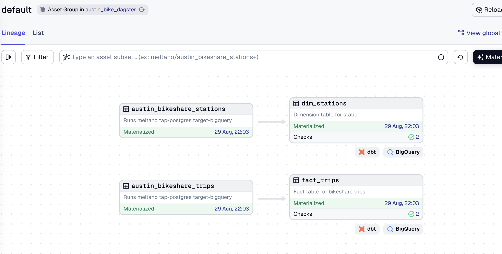

# SCTP DSAI DS2 Coaching ELT E2E Dagster - Austin Bike
### Add an Extractor to Pull Data from Postgres (Supabase)

We will use the `tap-postgres` extractor to pull data from a Postgres database hosted on [Supabase](https://supabase.com). 


Use the connection below:


```yaml
host: aws-0-us-east-2.pooler.supabase.com
port: 5432
database: postgres
user: postgres.ufkutyufdohbogiqgjel
pool_mode: session

```
We're going to add an extrator for Postgress to get our data. An extractor is responsible for pulling data out of any data source. We will use the `tap-postgress` extractor to pull data from the Supabase server. 

Create a new Meltano project by running:

```bash
meltano init austin_bike_meltano
cd austin_bike_meltano
```
To add the extractor to our project, run:

```bash
meltano add extractor tap-postgres
```

Next, configure the extractor by running:

```bash
meltano config tap-postgres set --interactive
```

Configure the following options:

- `database`: `postgres`
- `filter_schemas`: `['public']`
- `host`: `aws-0-ap-southeast-1.pooler.supabase.com` *(example)*
- `password`: *database password*
- `port`: `5432`
- `use_singer_decimal`: true
- `user`: *postgres.username*

Test your configuration:

```bash
meltano config tap-postgres test
```

Next, we need to select the correct table:
```bash
meltano select tap-postgres "public-austin_bikeshare_trips"
meltano select tap-postgres "public-austin_bikeshare_stations"
```
Check the tables
```bash
meltano select tap-postgres --list
```
We will now add a loader to load the data into BigQuery.

```bash
meltano add loader target-bigquery
```

```bash
meltano config target-bigquery set --interactive
```

Set the following options:

- `batch_size`: `104857600`
- `credentials_path`: _full path to the service account key file_
- `dataset`: `austin_bike_meltano_raw`
- `denormalized`: `true`
- `flattening_enabled`: `true`
- `flattening_max_depth`: `1`
- `location` : `US`
- `method`: `batch_job`
- `project`: *your_gcp_project_id*


### Run Supabase (Postgres) to BigQuery

We can now run the full ingestion (extract-load) pipeline from Supabase to BigQuery.

```bash
meltano run tap-postgres target-bigquery
```

You will see the logs printed out in your console. Once the pipeline is completed, you can check the data in BigQuery.


### Create Dbt project

To create a new dbt project.

```bash
dbt init austin_bike_dbt
```

Fill in the required config details. 
- use service account
- add your path of the json key file
- dataset: resale
- project: your GCP project ID

Please note that the profiles is located at the hidden folder .dbt of your home folder. The `profiles.yml` that is located in the home folder includes multiple projects. Alternatively, you can create a seprate `profiles.yml` for each project.

To create separate profiles for each project, create a new file called `profiles.yml` under `resale_flat` folder. Then copy the following to `profiles.yml`. Remember to change your key file location and your project ID.
```yaml
austin_bike_dbt:
  outputs:
    dev:
      dataset: austin_bike_analytics
      job_execution_timeout_seconds: 300
      job_retries: 1
      keyfile: /Users/zanelim/Downloads/personal/secret/meltano-learn-03934027c1d8.json # Use your path of key file
      location: US
      method: service-account
      priority: interactive
      project: meltano-learn # enter your google project id
      threads: 1
      type: bigquery
  target: dev
```

### Create source and models

We can start to create the source and models in the dbt project.

> 1. Create a `source.yml`.
```yaml
version: 2

sources:
  - name: austin_bike_meltano_raw
    tables:
      - name: public_austin_bikeshare_stations
      - name: public_austin_bikeshare_trips
```
> Create your own dimensions table

### Run Dbt

Check dbt connection first

```bash
dbt debug
```

Optional: you can run `dbt clean` to clear any logs or run file in the dbt folders.

Run the dbt project to transform the data.

```bash
dbt run
```

also run

```bash
dbt test
```

## Dagster Using dbt Integration

This is similar to lesson 2.7 Extra - Hands-on with Orchestration II, where we create a dbt-dagster integrated project and we add meltano as a subprocess.

Use the following command:

```bash
dagster-dbt project scaffold --project-name austin_bike_dagster --dbt-project-dir #full-path-to-the-austin-bike-dbt-project-directory
```

Next we would like to add meltano as subprocess.

```python
# assets.py
from dagster import AssetExecutionContext, multi_asset, AssetOut
from dagster_dbt import DbtCliResource, dbt_assets
import subprocess
from typing import Tuple
from .project import austin_bike_dbt_project

@multi_asset(
    outs={
        "austin_bikeshare_stations": AssetOut(key=["meltano", "austin_bikeshare_stations"]),
        "austin_bikeshare_trips": AssetOut(key=["meltano", "austin_bikeshare_trips"])
    }
)
def meltano_austin_bike_pipeline() -> Tuple[None, None]:
    """
    Runs meltano tap-postgres target-bigquery
    """
    cmd = ["meltano", "run", "tap-postgres", "target-bigquery"]
    cwd = '/Users/aiml/Documents/VSCode-Git/sctp-dsai-ds2-coaching-elt-e2e-dagster/austin_bike_elt_project/meltano-austin-bike'
    try:
        output= subprocess.check_output(cmd,cwd=cwd,stderr=subprocess.STDOUT).decode()
    except subprocess.CalledProcessError as e:
            output = e.output.decode()
            raise Exception(output)
    return (None, None)

# additional code below ....
```

On `definitions.py` we add meltano pipeline into the definitions
```python
# definitions.py
from dagster import Definitions
from dagster_dbt import DbtCliResource
from .assets import austin_bike_dbt_dbt_assets, meltano_austin_bike_pipeline
from .project import austin_bike_dbt_project
from .schedules import schedules

defs = Definitions(
    assets=[
        meltano_austin_bike_pipeline, 
        austin_bike_dbt_dbt_assets
    ],
    schedules=schedules,
    resources={
        "dbt": DbtCliResource(project_dir=austin_bike_dbt_project),
    },
)
```

The dependency can be set in dbt `source.yml` as follows:

```yml
version: 2

sources:
  - name: austin_bike_meltano_raw
    tables:
      - name: public_austin_bikeshare_stations
        meta:
          dagster:
            asset_key: ["meltano", "austin_bikeshare_stations"]
      - name: public_austin_bikeshare_trips
        meta:
          dagster:
            asset_key: ["meltano", "austin_bikeshare_trips"]
```

The final lineage graph is as follows:

