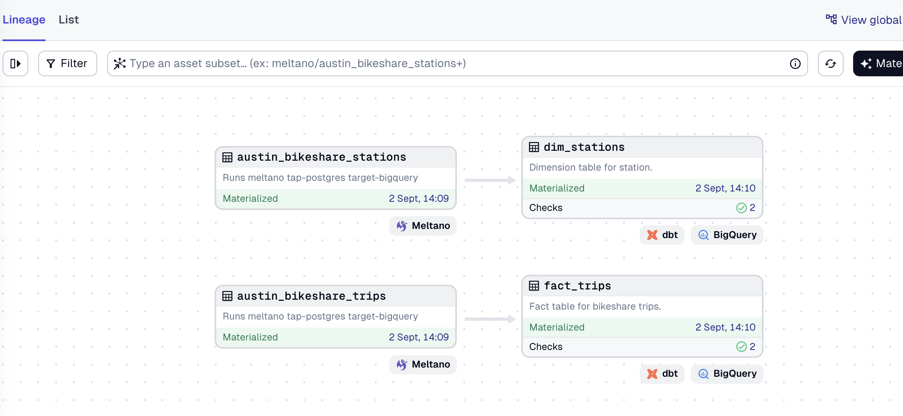

# SCTP DSAI DS2 Coaching ELT  E2E Dagster - Austin Bikeshare End to End Orchestration

You can change the current GCP settings in Meltano and dbt to get the project run. If you want to practice, you can create a new project folder as follows:

```bash
mkdir austin_bikeshare_e2e_dagster # Use different folder name for your practice
cd austin_bikeshare_e2e_dagster
```

Copy this instruction to the practice folder.

## Austin Bikeshare End to End Orchestration Setup Meltano
We will be using ready data from Postgres (Supabase) server. Due to the data size limitation for Supabase, we only upload 500k rows of data including headers to the Supabase. 

### Add an Extractor to Pull Data from Postgres (Supabase)

We will use the `tap-postgres` extractor to pull data from a Postgres database hosted on [Supabase](https://supabase.com). 

There are two tables `bikeshare_stations` and `bikeshare_trips`.

From Supabase, take note of your connection details from the Connection window, under Session Spooler:

```yaml
host: aws-0-us-east-2.pooler.supabase.com
port: 5432
database: postgres
user: postgres.ufkutyufdohbogiqgjel
pool_mode: session
```

We're going to add an extractor for Postgres to get our data. An extractor is responsible for pulling data out of any data source. We will use the `tap-postgress` extractor to pull data from the Supabase server. 

At the root folder, create a new Meltano project by running:

```bash
meltano init meltano_austin_bikeshare
cd meltano_austin_bikeshare
```

To add the extractor to our project, run:

```bash
meltano add extractor tap-postgres
```

Next, configure the extractor by running:

```bash
meltano config tap-postgres set --interactive
```

Configure the following options:

- `database`: `postgres`
- `filter_schemas`: `['public']`
- `host`: `aws-0-ap-southeast-1.pooler.supabase.com` *(example)*
- `password`: *database password*
- `user`: *postgres.username*

Test your configuration:
```bash
meltano config tap-postgres test
```

Next, we need to select the table that we need:
```bash
meltano select tap-postgres "public-austin_bikeshare_trips"
meltano select tap-postgres "public-austin_bikeshare_stations"
```

Use the following command to list
```bash
meltano select tap-postgres --list
```

### Add an Loader to Load Data to BigQuery
We will now add a loader to load the data into BigQuery.
```bash
meltano add loader target-bigquery
```

```bash
meltano config target-bigquery set --interactive
```

Set the following options:

- `batch_size`: `104857600`
- `credentials_path`: _full path to the service account key file_
- `dataset`: `austin_bikeshare_dagster_raw`
- `denormalized`: `true`
- `flattening_enabled`: `true`
- `flattening_max_depth`: `1`
- `method`: `batch_job`
- `project`: *your_gcp_project_id*


### Run Supabase (Postgres) to BigQuery

We can now run the full ingestion (extract-load) pipeline from Supabase to BigQuery.

```bash
meltano run tap-postgres target-bigquery
```

You will see the logs printed out in your console. Once the pipeline is completed, you can check the data in BigQuery.


## Austin Bikeshare End to End Orchestration Setup dbt

Let's create a Dbt project to transform the data in BigQuery. 

To create a new dbt project. (make sure you exited the meltano folder)

```bash
dbt init dbt_austin_bikeshare
```

Fill in the required config details. 
- use service account
- add your path of the json key file
- dataset: austin_bikeshare_dagster
- project: your GCP project ID

Please note that the profiles is located at the hidden folder .dbt of your home folder. To create separate profiles for each project, create a new file called `profiles.yml` under `rdbt_austin_bikeshare` folder. Then copy the following to `profiles.yml`. Remember to change your key file location and your project ID.
```yaml
dbt_austin_bikeshare:
  outputs:
    dev:
      dataset: austin_bikeshare_dagster
      job_execution_timeout_seconds: 300
      job_retries: 1
      keyfile: /Users/zanelim/Downloads/personal/secret/meltano-learn-03934027c1d8.json # Use your path of key file
      location: US
      method: service-account
      priority: interactive
      project: meltano-learn # enter your google project id
      threads: 1
      type: bigquery
  target: dev
```

### Create source and models

We can start to create the source and models in the dbt project.

> 1. Create a `source.yml`.
```yaml
version: 2

sources:
  - name: austin_bikeshare_dagster_raw
    tables:
      - name: public_austin_bikeshare_stations
      - name: public_austin_bikeshare_trips
```
> Create your own dimensions table

> (Optional) If you have star schema, please remember to set materialization either as view or table in the `dbt_project.yml` as follows:

```yaml
# files using the `{{ config(...) }}` macro.
models:
  dbt_austin_bikeshare:
    +materialized: table
    star:
      +materialized: table
      +schema: star
```

### Run Dbt

Check dbt connection first

```bash
dbt debug
```

Optional: you can run `dbt clean` to clear any logs or run file in the dbt folders.

Run the dbt project to transform the data.

```bash
dbt run
```

Next run dbt test 
```bash
dbt test
```

## Dagster Using dbt Integration

This is similar to lesson 2.7 Extra - Hands-on with Orchestration II, where we create a dbt-dagster integrated project and we add meltano as a subprocess.

Use the following command (exit dbt folder if not already done so):

```bash
dagster-dbt project scaffold --project-name dagster_dbt_integration_austin_bikeshare --dbt-project-dir #full-path-to-the-resale-flat-dbt-project-directory
```

In our example, we can use relative path
```bash
dagster-dbt project scaffold --project-name dagster_dbt_integration_austin_bikeshare --dbt-project-dir ./dbt_austin_bikeshare/
```

Next we would like to add meltano as subprocess.

```python
# assets.py
from dagster import AssetExecutionContext, multi_asset, AssetOut
from dagster_dbt import DbtCliResource, dbt_assets
import subprocess
from typing import Tuple
from .project import dbt_austin_bikeshare_project

@multi_asset(
    outs={
        "austin_bikeshare_stations": AssetOut(key=["meltano", "austin_bikeshare_stations"]),
        "austin_bikeshare_trips": AssetOut(key=["meltano", "austin_bikeshare_trips"])
    },
    compute_kind="meltano",
)
def meltano_austin_bike_pipeline() -> Tuple[None, None]:
    """
    Runs meltano tap-postgres target-bigquery
    """
    cmd = ["meltano", "run", "tap-postgres", "target-bigquery"]
    cwd = '/path/to/your/meltano/folder/meltano_austin_bikeshare'
    try:
        output= subprocess.check_output(cmd,cwd=cwd,stderr=subprocess.STDOUT).decode()
    except subprocess.CalledProcessError as e:
            output = e.output.decode()
            raise Exception(output)
    return (None, None)


@dbt_assets(manifest=dbt_austin_bikeshare_project.manifest_path)
def dbt_austin_bikeshare_dbt_assets(context: AssetExecutionContext, dbt: DbtCliResource):
    yield from dbt.cli(["build"], context=context).stream()
```
> Please copy the meltano directory path to the `cwd` field above.

On `definitions.py` we add meltano pipeline into the definitions
```python
# definitions.py
from dagster import Definitions
from dagster_dbt import DbtCliResource
from .assets import dbt_austin_bikeshare_dbt_assets, meltano_austin_bike_pipeline
from .project import dbt_austin_bikeshare_project
from .schedules import schedules

defs = Definitions(
    assets=[dbt_austin_bikeshare_dbt_assets, meltano_austin_bike_pipeline],
    schedules=schedules,
    resources={
        "dbt": DbtCliResource(project_dir=dbt_austin_bikeshare_project),
    },
)
```

To add dependency we modified in dbt `source.yml` as follows:

```yml
version: 2

sources:
  - name: austin_bikeshare_dagster_raw
    tables:
      - name: public_austin_bikeshare_stations
        meta:
          dagster:
            asset_key: ["meltano", "austin_bikeshare_stations"]
      - name: public_austin_bikeshare_trips
        meta:
          dagster:
            asset_key: ["meltano", "austin_bikeshare_trips"]
```
The following is optional, you can also define a scheduler job as follows:
```python
"""
To add a schedule that materializes your dbt assets, uncomment the following lines.
"""
from dagster_dbt import build_schedule_from_dbt_selection
from dagster import define_asset_job, ScheduleDefinition
from .assets import dbt_austin_bikeshare_dbt_assets, meltano_austin_bike_pipeline

# Create a job that includes both assets
e2e_etl_job = define_asset_job(
    name="materialize_elt",
    selection=[meltano_austin_bike_pipeline, dbt_austin_bikeshare_dbt_assets]
)

# Create schedule for the job
schedules = [
    ScheduleDefinition(
        job=e2e_etl_job,
        cron_schedule="0 6 5 * *",  # 5th of every month at 6 AM
        name="monthly_etl_schedule"
    )
]
```

Run the dagit

```bash
dagster dev
```

The final lineage graph is as follows:



